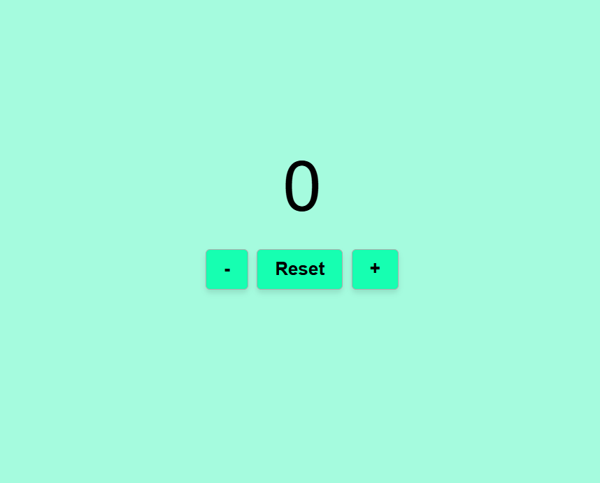

## Web counter js

Progetto JavaScript Chiara Marando - Web Counter in js  
L'applicazione web consiste in un contatore semplice.

## Funzionalità

E' possibile:  
-incrementare il valore  
-decrementare il valore (senza poter però scendere sotto lo zero)  
-resettare il valore  
-salvare il valore in localStorage  

## Screenshot
[screenshot counter]

  

## Link

https://chiara-marando-web-counter.netlify.app/
